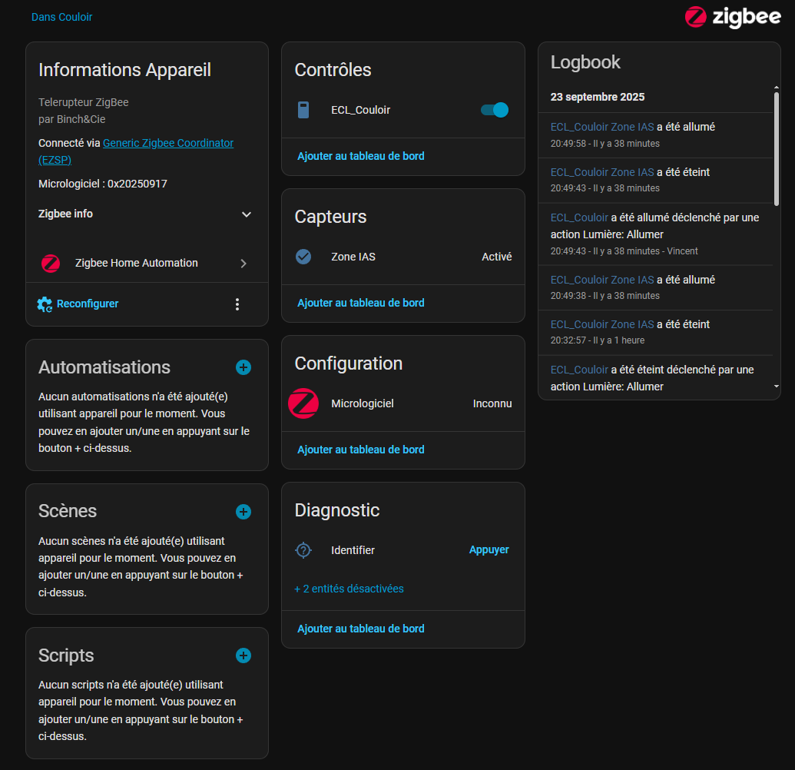

# Telerupteur ZigBee FR
Carte de commande pour le contrôle d'un télérupteur avec retour d'état du contact.


  
## Pourquoi
Le télérupteur Legrand Ref. 1 991 21 Drivia ne remplisse pas mon cahier des charges.
J'ai un bon vieux télérupteur à bobine, avec lequel il est possible d'avoir des témoins visuels. (LED)
L'autre avantage, c'est qu'il n'y a aucun câblage à modifier.

## Liste des composants

Détail dans le ficier ibom.html
- [µP ESP32H2 SuperMini (x1)](https://fr.aliexpress.com/item/1005007235112528.html)
- [Relais HF49FD (x1) HF49FD-005-1H11](https://fr.aliexpress.com/item/1005005163929430.html)

Pour le moment le circuit est maintenu chez moi avec cette boite, dans une GTL. Prendre la version 50-100mm suffit. https://fr.aliexpress.com/item/32624897936.html

## Home Assistant Template

Modifier le template selon vos besoin.
Chez moi l'appareil porte le nom de ECL_Couloir. Il faudra remplacer les "ecl_couloir" (x3) par votre dénomination.

```
template:
  #Bouton + lumière Telerupteur
  - light:
      - name: "ECL_Couloir"
        unique_id: ecl_couloir
        state: >
          {{ is_state('binary_sensor.ecl_couloir_zone_ias', 'off') }}
        turn_off:
          service: switch.toggle
          target:
            entity_id: switch.ecl_couloir
        turn_on:
          service: switch.toggle
          target:
            entity_id: switch.ecl_couloir
```

## Évolution :
En fonction des demandes, il sera possible de continuer à développer le projet.
Ceci n'est que quelques idées que j'avais en tête.

- Création d'une boite à imprimer en 3D
- Quirk ZHA
- Mise à jour par OTA

## Divers
J'ai la possibilité d'expédier une carte vierge ou même prêt à l'utilisation selon vos besoins.

# ZigBee Remote Switch EN
Control board for controlling a remote switch with contact status feedback.


## Why
The Legrand remote switch Ref. 1 991 21 Drivia doesn't meet my specifications.
I have a good old coil remote switch, which can be equipped with visual indicators (LEDs).
The other advantage is that there's no wiring to modify.

## Component List

Details in the ibom.html file
- [µP ESP32H2 SuperMini (x1)](https://fr.aliexpress.com/item/1005007235112528.html)
- [HF49FD Relay (x1) HF49FD-005-1H11](https://fr.aliexpress.com/item/1005005163929430.html)

For now, the circuit is maintained at home with this box, in a GTL. The 50-100mm version is sufficient. https://fr.aliexpress.com/item/32624897936.html

## Home Assistant Template

Modify the template according to your needs.
At home, the device is called ECL_Couloir. You will need to replace "ecl_couloir" (x3) with your name.

```
template:
  #Bouton + lumière Telerupteur
  - light:
      - name: "ECL_Couloir"
        unique_id: ecl_couloir
        state: >
          {{ is_state('binary_sensor.ecl_couloir_zone_ias', 'off') }}
        turn_off:
          service: switch.toggle
          target:
            entity_id: switch.ecl_couloir
        turn_on:
          service: switch.toggle
          target:
            entity_id: switch.ecl_couloir
```

## Evolution:
Depending on demand, it will be possible to continue developing the project.
These are just a few ideas I had in mind.

- Creation of a 3D printed box
- Quirk ZHA
- OTA updates

## Miscellaneous
I can ship a blank card or even a ready-to-use one, depending on your needs.


