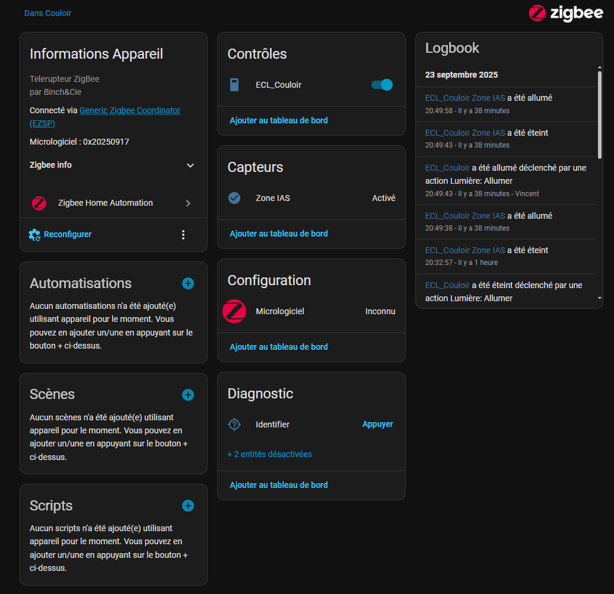

# Telerupteur ZigBee FR
Carte de commande pour le contrôle d'un télérupteur avec retour d'état de l'éclairage.

  
## Pourquoi
Le télérupteur Legrand Drivia 1.991.21 ne remplis pas mon cahier des charges.
J'ai un bon vieux télérupteur à bobine, avec lequel il est possible d'avoir des témoins visuels sur chaque bouton-poussoir. (LED)
L'autre avantage, c'est qu'il se monte comme un bouton-poussoir à l'emplacement voulu.
Il faut également récupérer une alimentation (la même que le télérupteur) ainsi que la puissance de l'éclairage.  

## Liste des composants

Détail dans le ficier ibom.html
- [µP ESP32H2 SuperMini (x1)](https://fr.aliexpress.com/item/1005007235112528.html)
- [Relais HF49FD (x1) HF49FD-005-1H11](https://fr.aliexpress.com/item/1005005163929430.html)

Pour le moment le circuit est maintenu chez moi avec cette boite, dans une GTL. Prendre la version 50-100mm suffit. https://fr.aliexpress.com/item/32624897936.html

## Schéma
- Câblage
- Installation perso

## Évolution :
En fonction des demandes, il sera possible de continuer à développer le projet.
Ceci n'est que quelques idées que j'avais en tête.

- Création d'une boite à imprimer en 3D
- Mise à jour par OTA

## Divers
J'ai la possibilité d'expédier une carte vierge ou même prêt à l'utilisation selon vos besoins.

# ZigBee Remote Switch EN
Control board for controlling a remote switch with lighting status feedback.

## Why
The Legrand Drivia 1.991.21 remote switch doesn't meet my requirements.
I have a good old-fashioned coil-type remote switch, which allows for visual indicators on each push button (LEDs).
Another advantage is that it can be mounted like a push button in the desired location.
It also requires a power supply (the same as the remote switch) and the power supply for the lighting.

## Component List

Details in the ibom.html file
- [µP ESP32H2 SuperMini (x1)](https://fr.aliexpress.com/item/1005007235112528.html)
- [HF49FD Relay (x1) HF49FD-005-1H11](https://fr.aliexpress.com/item/1005005163929430.html)

For now, the circuit is maintained at home with this box, in a GTL. The 50-100mm version is sufficient. https://fr.aliexpress.com/item/32624897936.html

## Diagram
- Wiring
- Custom Installation

## Evolution:
Depending on demand, it will be possible to continue developing the project.
These are just a few ideas I had in mind.

- Creation of a 3D printed box
- OTA updates

## Miscellaneous
I can ship a blank card or even a ready-to-use one, depending on your needs.

